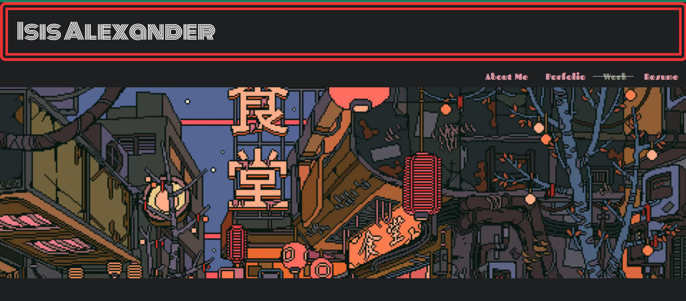

# Portfolio V2

## Description 

Here is a link to the deployed application on Github:

https://queenofbirbs.github.io/portfolio-v2/

This is the second version of my portfolio and currently not in use. The changes from my first portfolio are mainly that this one uses Bootstrap and more complex CSS styling. Pictures of the finished app are all included in the images folder!

## Table of Contents
- [Installation](#installation)
- [Usage](#usage)
- [Contributing](#contributing)
- [License](#license)
- [Questions](#questions)

## Installation

To run this application locally make sure to copy the files and run npm install to have all of the correct dependencies. Otherwise please follow the link in the description or above to try out the deployed version yourself!

## Usage

This is largely for personal use though feel free to look around!
Here is a screenshot of the application:

## Contributing

Isis Alexander (https://github.com/QueenOfBirbs)

## License

This application is covered under MIT license. 

## Questions

You can reach us at goddess.isis.alexander@gmail.com if you have any questions!

